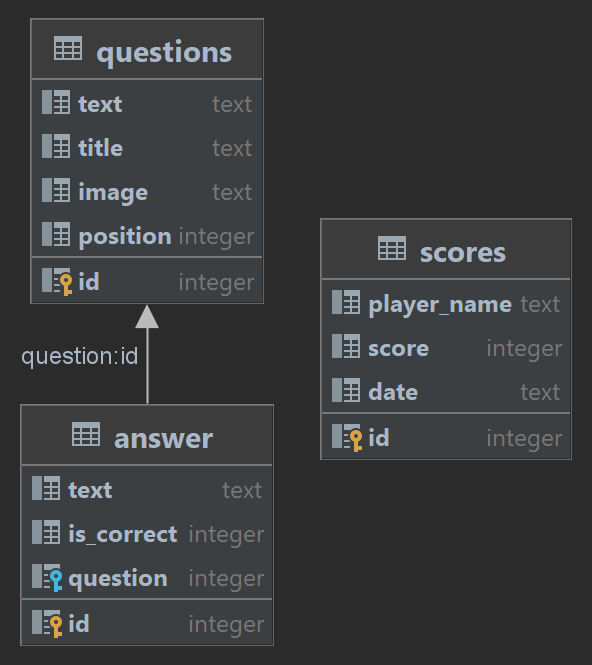

# QuizApp ESIEE
Quiz web application - Projet web full stack ESIEE E4FI

## Membres (groupe 21)
* [Jenny CAO](https://github.com/jennycjay)
* [Juan IVANOFF](https://github.com/AaronJI185)
* [Théo SZANTO](https://github.com/indyteo)

## Installation
Les deux images Docker présentes sur le Docker Hub permettent de faire tourner l'API Python en Flask et le front-end en Vue :
* API : https://hub.docker.com/r/indyteo/quiz-prod-api
* UI : https://hub.docker.com/r/indyteo/quiz-prod-ui

## Utilisation
L'application web dispose d'une page de participation au quiz ainsi qu'une page d'administration. Voici le schéma de la base de données SQLite embarquée :

